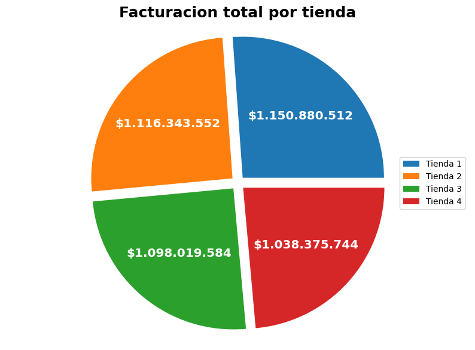

# 📦 AluraStore - challenge AluraLATAM

> [!NOTE]
> Proyecto simulación de un caso real en el que se busca ayudar al señor Juan a decidir cual de sus 4 tiendas deberia vender para invertir en su nuevo negocio.

## 🚀 Estructura de Archivos

    - `images/`
     - `Facturacion`
     - `Calificacion`
     - `Costo envio`
     - `Ventas por categoria`
     - `Mapa`
    - `AluraStoreLatam.ipynb`
    - `README.md`

## 📓 Cuaderno Principal

Contenido del cuaderno:
- Análisis exploratorio de datos (EDA).
- Limpieza y preprocesamiento (Si aplica).
- Modelado (si aplica).
- Visualizaciones.
- Resultados obtenidos.

## 🛠️ Tecnologías requeridas

- [Python] (v3.13)
- [Pandas - Matplotlib - Numpy - Seaborn - Plotly]
- [Google Colab]

## 💡 Uso básico

- Ingresar al google colab predispuesto en el archivo AluraStoreLatam.ipynb y ejecutar todas las celdas.

✨ Funcionalidades destacadas

 ✅  Facturación total.

 ✅  Categorías más populares.
 
 ✅  Promedio de evaluación de clientes.

 ✅  Productos más y menos vendidos.

 ✅  Costo promedio de envío.

 ✨ Extra

 ✅ Análsis geográfico de las ventas.

 Resultados del modelo:

 
 
 
 
 
 
👤 Autor

Nicolás – @nxzK1
